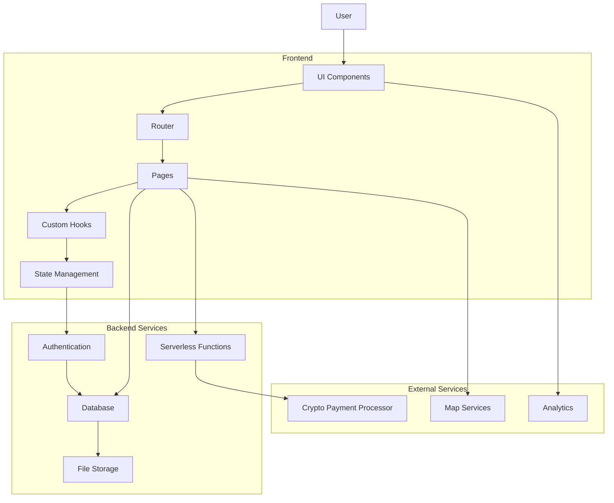
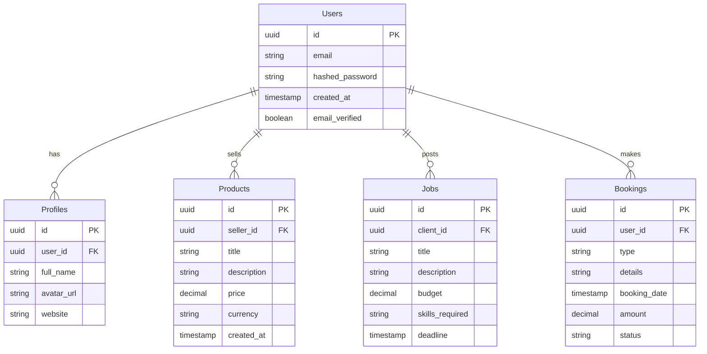

# System Architecture

This document provides a high-level overview of the InfiWorld system architecture.

## System Overview Diagram

## Core Components

### Frontend Architecture

#### Pages Layer
| Component | Description | Dependencies |
|-----------|-------------|--------------|
| Index | Landing page | Layout, Hero, FeatureSection |
| MarketplacePage | Product marketplace | Layout, ProductCard, Filters |
| FreelancePage | Freelance services | Layout, FreelancerCard, JobCard |
| TravelPage | Travel booking | Layout, Travel components, Maps |
| ProfilePage | User profile | Layout, Profile components, Avatar |
| WalletPage | Crypto wallet | Layout, Wallet components |
| VerificationPage | User verification | Layout, Form components |
| MapPage | Interactive map | Layout, Map components |
| NotFound | 404 error page | Layout |

#### UI Components
Built with shadcn/ui and Tailwind CSS, our UI components provide consistent, accessible, and responsive design elements:

- **Design System**: Color schemes, typography, spacing
- **Component Library**: Buttons, Cards, Inputs, Modals, etc.
- **Layout Components**: Containers, Grids, Flexbox wrappers

#### State Management
- **Context API**: Auth, Theme, Notifications
- **TanStack Query**: Data fetching, caching, and state synchronization
- **Local Component State**: Form state, UI interactions

### Backend Architecture (Supabase)

#### Authentication
- Email/password authentication
- OAuth providers integration
- JWT token management
- Role-based access control

#### Database Schema

#### File Storage
- Profile images
- Product images
- Document storage

#### Serverless Functions
- Payment processing
- Notifications
- External API integrations

### External Services Integration

#### Cryptocurrency Payments
- Multi-wallet support
- Transaction processing
- Payment verification

#### Map Services
- Location-based search
- Interactive maps
- Geocoding

#### Analytics and Reporting
- User behavior tracking
- Performance metrics
- Business intelligence

## Data Flow

1. **User Authentication Flow**
   - User submits credentials
   - Auth service validates credentials
   - JWT token generated and stored
   - User data loaded from database

2. **Marketplace Transaction Flow**
   - User browses products
   - User initiates purchase
   - Payment processed through crypto service
   - Transaction recorded in database
   - Notification sent to seller

3. **Freelance Booking Flow**
   - Client posts job
   - Freelancers submit proposals
   - Client selects freelancer
   - Escrow payment created
   - Work delivered and payment released

4. **Travel Booking Flow**
   - User searches for travel options
   - User selects and customizes booking
   - Payment processed
   - Booking confirmed in database
   - Travel vouchers generated

## Security Measures

- **Authentication**: JWT tokens, secure password storage
- **Database Access**: Row-level security policies
- **API Security**: CORS configuration, rate limiting
- **Frontend Security**: XSS protection, CSRF prevention
- **Data Encryption**: Encrypted connections, sensitive data protection

## Scalability Considerations

- **Component Modularity**: Independent components for easy maintenance
- **Lazy Loading**: Code splitting for optimized loading
- **Database Indexing**: Performance optimization for queries
- **CDN Integration**: Static asset delivery
- **Serverless Architecture**: Automatic scaling based on demand
